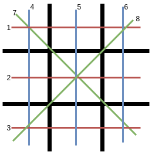

.. qnum::
   :start: 1
   :prefix: lab06-01-

Lab 6-1: Tic Tac Toe
====================

Lab Requirements and Specifications
-----------------------------------

Now that we have learned 2-Dimensional arrays, the first game you will be creating that uses a board is Tic Tac Toe!  

The following are the gameplay requirements:
    - This game is to be played by two human players, X and O.
    - Players X and O should alternate turns placing pieces, with X going first.  Players choose their position by entering a position (from 1 to 9 inclusive) on the board.
    - The game should check to make sure that the players are choosing valid positions to place their pieces.  If the player chooses an invalid position, he/she should be prompted again until he/she enters a valid position.
    - The game should detect when the game is over (when someone has won / if it's a tie)
    - You must validate all inputs - the user should not be able to crash the program.

The following are your code requirements:
    - Functions should be heavily used throughout the game, and each function should have a single, well-defined purpose.
    - Comments should be used to clarify processes and algorithms.
    - Variable names should be descriptive and relevant.
    - You should use a 2-dimensional list to check if a player has won.

If you are not familiar with the tic tac toe board, it's simply a grid 3 spaces tall, 3 spaces wide.  It's typically drawn without its outer borders.  Here is a sample ASCII representation of a tic tac toe board:

.. code-block:: none
    
     1 | 2 | 3
    ---+---+---
     4 | 5 | 6
    ---+---+---
     7 | 8 | 9

(Xs and Os would be placed in the numbers)

Despite intuition telling us that we should use a 2D list for this, it would make our lives much more complicated than necessary.  Instead, we can use a one-dimensional list for this, giving each position on the board a set number from 1 through 9.  The player will pick their move by selecting a number from 1 to 9.

So where do 2D lists come into play?  Since tic tac toe is played on a small board, there are limited winning sequences:
    - 3 for the rows (red)
    - 3 for the columns (blue)
    - 2 for the diagonals (green)

Since there are only eight possibilities of winning, you can check to see whether the game has ended by checking all possible winning sequences.  The eight winning sequences are saved in a **2-Dimensional list**, where:
    - The outer list is the list of all wins
    - The inner list is the positions for each set of wins

The list of possible wins can be written in code as the following:

.. code-block:: python
    
    possible_wins = [[0,1,2], # first row
                     [0,4,8],  # topleft diagonal
                     ... #and so on
                    ]

You will know when someone has won when, for example, the 0th, 4th, and 8th position on the board are all non-empty and contain the same character.

You may use the following function to print your board, as well as the board initialization.

.. code-block:: python
    
    def print_board(board):
        print(" {} | {} | {}".format(board[0],board[1],board[2]))
        print("---+---+---")
        print(" {} | {} | {}".format(board[3],board[4],board[5]))
        print("---+---+---")
        print(" {} | {} | {}".format(board[6],board[7],board[8]))
        
.. code-block:: python
    
    board = [1,2,3,4,5,6,7,8,9]

One thing to note is to be careful about what you present to the user and what numbers should actually be used in the code.  The following diagram illustrates the difference.

Some extra tips to keep in mind:
    - Start by breaking the game down into small functions.  For each function, write:
    
        - The name of the function (should be a verb!)
        - The purpose of the function
        - What arguments it will need, if anything
        - What it will return (including the conditions under which it will return), if anything
    - You can use ``str.isdigit()`` to test if a string represents a positive integer.  Examples:
    
        - ``"5".isdigit() == True``
        - ``"-5".isdigit() == False``
        - ``"hi5".isdigit() == False``
        - ``"3.5".isdigit() == False``
    - Using the above, don't forget that it still has to be an integer to be used as a list index!  Having something like ``board["5"]`` will throw an error.

You should name your file ``FILN_tictactoe.py``, where FILN is your first initial and last name, no space.

Testing Your Program
--------------------

One of the newest parts about this lab is that **users should not be able to crash your program through incorrect inputs**.  Your code should handle all cases of possible inputs, including those that are not numbers.  When playtesting your game, be sure to try every possible scenario to cover your bases.

Below is a sample runthrough:

::
    
     1 | 2 | 3
    ---+---+---
     4 | 5 | 6
    ---+---+---
     7 | 8 | 9
    
    Player X, enter your move as a number from 1 to 9: -1
    Invalid input, try again
    Player X, enter your move as a number from 1 to 9: ahasdf
    Invalid input, try again
    Player X, enter your move as a number from 1 to 9: 3.3
    Invalid input, try again
    Player X, enter your move as a number from 1 to 9: * 
    Invalid input, try again
    Player X, enter your move as a number from 1 to 9: 4
    
     1 | 2 | 3
    ---+---+---
     X | 5 | 6
    ---+---+---
     7 | 8 | 9
    
    Player O, enter your move as a number from 1 to 9: 6
    
     1 | 2 | 3
    ---+---+---
     X | 5 | O
    ---+---+---
     7 | 8 | 9
    
    Player X, enter your move as a number from 1 to 9: 1
    
     X | 2 | 3
    ---+---+---
     X | 5 | O
    ---+---+---
     7 | 8 | 9
    
    Player O, enter your move as a number from 1 to 9: 7
    
     X | 2 | 3
    ---+---+---
     X | 5 | O
    ---+---+---
     O | 8 | 9
    
    Player X, enter your move as a number from 1 to 9: 5
    
     X | 2 | 3
    ---+---+---
     X | X | O
    ---+---+---
     O | 8 | 9
    
    Player O, enter your move as a number from 1 to 9: 9
    
     X | 2 | 3
    ---+---+---
     X | X | O
    ---+---+---
     O | 8 | O
    
    Player X, enter your move as a number from 1 to 9: 8
    
     X | 2 | 3
    ---+---+---
     X | X | O
    ---+---+---
     O | X | O
    
     X | 2 | O
    ---+---+---
     X | X | O
    ---+---+---
     O | X | O
    
    Player O, enter your move as a number from 1 to 9: 3
    Tic Tac Toe, 3 in a row!
    Player O wins!

The following space is provided in case you want to test code out or write it in the browser:

.. activecode:: labspace-06-01

    #Write and run code here!

Taking it Further
-----------------

This would be a really cool program to write AI for - so you could play tic tac toe against a computer (technically, you can make an AI that will never lose at tic tac toe).

To start, you would need to come up with an algorithm that the computer can follow.  To start, you might have something like this:

::

    # Start of AI's turn
    
    # check: is there any position (using list of possible wins) that I can place where I would win?
    # then check: is there any position (using list of possible wins) that I can place where I would block an opponent from winning on the next turn?
    
    #etc...

If you would like to ``import random`` to have your AI bot randomly place pieces down, either all the time or conditionally, that would work (although placing pieces down randomly every turn makes for a bad AI).  Ideally you would have a function that checks whether a move is valid or not; this function can be used with the AI as well if it is randomly placing pieces.  The implementation is largely up to you!

As a challenge, see if you can make an unbeatable AI.  It is definitely possible - Tic Tac Toe is a game where two opponents at high skill will always tie.