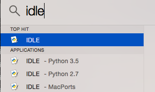

.. qnum::
   :start: 1
   :prefix: u0002-

Lesson 00-02: Installing Python
===============================

On Your Local Computer
----------------------

This book uses Python 3.x syntax.  You can download and install python `here. <https://www.python.org/downloads/>`_.  Please make sure you choose to install python version 3.x.  

If you're not sure whether you have python installed or not, you can open up your terminal (mac) or command prompt (windows) and enter the following commands:

.. code-block:: none

    python --version
    python3 --version

The first command, ``python --version``, will provide the default python version installed, which is typically version 2.x.  The second command, ``python3 --version``, will provide the version of python3 if it is installed.  If you see something like the following, you will be good to go.

.. code-block:: none
    
    user:~/workspace/sols (master) $ python --version
    Python 2.7.6
    
    user:~/workspace/sols (master) $ python3 --version
    Python 3.4.3

Python comes with IDLE, which is the packaged python IDE.  If you are totally new, you can use this, but be careful of how you space things out.  More on this later.  But important: Make sure you are using IDLE3!  If you use the regular IDLE, it will run with python 2.x, which won't work with some of the code that we use.  On a mac, you'll know that it's IDLE3 when you see the version number:

If you are familiar with some simple terminal commands (knowing how to traverse directories), I would recommend using a text editor instead.  `Sublime Text <https://www.sublimetext.com/3>`_ and `Atom <https://atom.io/>`_ are two robust, popular text editors.  If you are on Windows, `Notepad++ <https://notepad-plus-plus.org/>`_ is also good.

If you are looking for a fully-featured python IDE, I recommend `Pycharm <https://www.jetbrains.com/pycharm/download/>`_, but only if you know what you are doing.  If you are new to python and programming, just stick with one of the text editors above.

Using an Online IDE
-------------------

If you choose to write your code online, I highly suggest using `c9.io <https://c9.io/>`_.  Not only is it a fully-fledged linux virtual machine, but the interface is great.  This entire book, along with all of the lab solutions, were written on a c9 workspace.  An account is free, but a credit card is required at signup. VISA/Amex gift cards should work to get around it, but if you don't feel safe with it, or if you need a way around it, please don't hesitate to contact me.

Please be aware that the examples in this online book (as well as many other online python sites) use `Skulpt <http://www.skulpt.org/>`_, which is a Javascript implementation of Python, and behavior here may not reflect how python is actually run.  For this reason, I highly suggest doing labs in an actual python environment (like c9 or on your local machine).