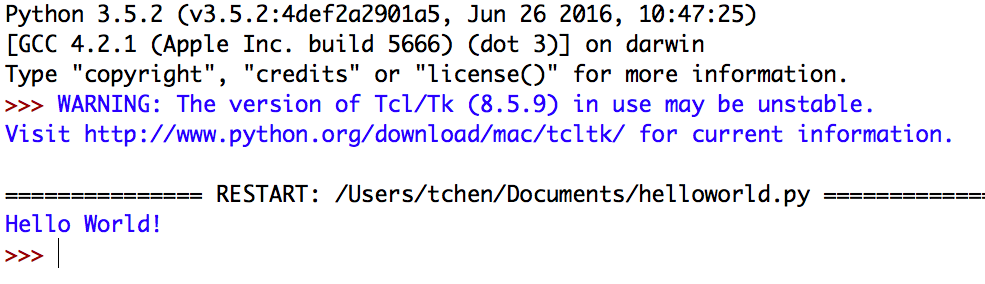
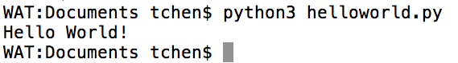
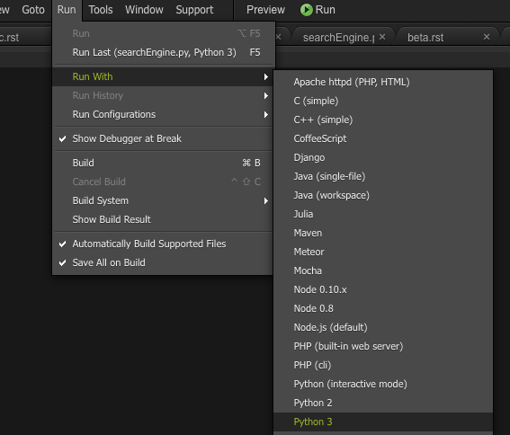
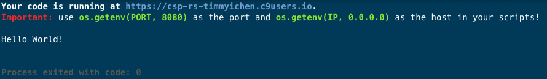

.. qnum::
   :start: 1
   :prefix: u0003-

Lesson 00-03: Running Python Programs
=====================================

Feel free to skip to the section below that is most relevant to you.

On Your Local Computer (IDLE)
-----------------------------

With IDLE open, you can go to ``File`` > ``New File`` to create a new file.  Type in the following:

::
    
    print("Hello World!")

Then save the file through ``File`` > ``Save As`` and save it with the filename ``helloworld.py``.  The ``.py`` at the end is very important, as it makes it clear that it is a python script file.

You can then run the program by going to ``Run`` > ``Run Module``.  Your output might look something like this:

  
If so, then congratulations!  It worked!

On Your Local Computer (text editor)
------------------------------------

If you are reading this, you probably plan on writing code in a text editor.  In your text editor of choice, create a new file and type the following:

::
    
    print("Hello World!")

Save the file as ``helloworld.py``.  Then open up your terminal (mac/linux) or command prompt (windows).

Navigate to your the folder that contains your ``helloworld.py`` file.  The commands to do this will vary depending on operating system.

To run your file using python3, type in the following command into your terminal:

.. code-block:: none
    
    python3 helloworld.py

And you should see an output like so:

If you do, congratulations!  It worked!

Through Cloud9
--------------

On c9, you create a new file by clicking on the ``+`` icon, or by going to ``File`` > ``New File``.  Type in the following:

::
    
    print("Hello World!")

Save your file as ``helloworld.py``.  To run the file, click on ``Run`` > ``Run With`` > ``Python 3``.  If you just hit ``> Run`` at the top, it will default to python2.  You want python3.

Your output should look like this:

If that is what you see, then congrats! It worked!