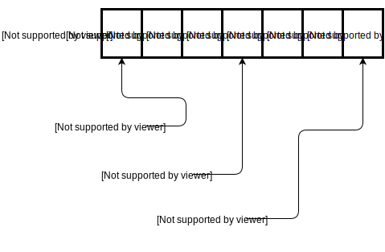

.. qnum::
   :start: 1
   :prefix: ch0202-

Lesson 02-02: Specific Letters with String Indexing
===================================================

**Learning Target: I can use the len() function to find the length of a string.**
**Learning Target: I can use string indexing to reference specific letters in a string.**

Length of a String
------------------

The ``len()`` function is a function that will provide the length of a string.  The length of a string is basically the number of characters in the string, spaces included.  Here are a few quick examples:

.. activecode:: ex_strlen_1
    :autorun:
    
    print(len("hello!")) # ==> 6
    print(len("h e y there")) # ==> 11
    name = "Bobert"
    print("\n") #ignore this line
    print("The name {} has {} characters".format(name,len(name)))
    #should print "The name Bobert" has 6 characters"

Finding a Specific Letter in a String
-------------------------------------

We can point to a specific character within a string by using string indexing.  Every letter, digit, space, or symbol in a string has a :vocab-def:`position in a string`, also known as its :vocab-word:`index`.

We use :vocab-word:`string indexing` to :vocab-def:`reference a specific character in the string by using its index`.  The way that this is done is through brackets ``[]`` right after the string, with a number inside.

Try to predict what the following code will print:

.. activecode:: ex_strindex_1
    :nocodelens:

    print("Hello"[4]) #the 4th position of the string
    print("Hello"[1]) #the 1st position of the string

Was it what you expected?  If this is your first time seeing string indexing, you were probably off by one.  That's because strings use :vocab-word:`zero-based indexing`, which is when :vocab-def:`the index always starts counting from zero`, instead of one.

Here's an example of the values of ``word[0]``, ``word[3]``, and ``word[6]`` for a variable ``word = "POKEMON"``.

    
It's worth noting that :misc-hl:`string indexing gives you a string as the result`.

:misc-hl:`Please keep in mind that from this point on, this book will use 0-based indexing as well.`  So if you read "the 4th position" or "the 4th letter", it is the same as saying "the 4th index"

What happens if you reference a position that's greater than the length of the string itself?  Try running the code and see:

.. activecode:: ex_strindex_2
    :nocodelens:
    
    word = "POKEMON"
    print(word[100])

:misc-hl:`Trying to reference a position that's past the end of the string will give you an error!`  And it even gives us a descriptive error message as well.  Use this to your advantage when you come across it.

Typically, to find the last character in a string *without knowing what the string is going to be*, we would use the expression ``word[len(word)-1]``.  But in python, there's an easier way.

Negative String Indexing
------------------------

You can provide negative numbers as indexes as well.  Its behavior is interesting.  See the example below:

.. activecode:: ex_negindex_1
    :nocodelens:
    
    word = "abcdef"
    print(word[-1])
    print(word[-2])
    print(word[-3])

As you can see, :misc-hl:`when you provide a negative number, it starts counting from the end, with the last letter having an index of -1`.  This is very important because this allows us to use string indexing to things like "the second to last letter" of a string.

Checks For Understanding
------------------------

Q#1
~~~

.. mchoice:: cfu_strindex_1
    :correct: d
    :answer_a: "p"
    :answer_b: "t"
    :answer_c: "A"
    :answer_d: "a"
    :feedback_a: Remember that spaces count!
    :feedback_b: Don't forget to start counting from 0!
    :feedback_c: There are no capitals in this string..
    :feedback_d: Great job!
    
    With word = "duck tape", what would the expression word[6] give us?

Q#2
~~~

.. mchoice:: cfu_strindex_2
    :multiple_answers:
    :correct: b,c,d
    :answer_a: word["last"]
    :answer_b: word[-1]
    :answer_c: word[len(word)-1]
    :answer_d: word[6]
    :answer_e: word[7]
    :feedback_e: Don't forget to start counting from 0!
    
    With word = "battery", which ways can we access the last letter?  Check all that apply.

Q#3
~~~

.. mchoice:: cfu_strindex_3
    :correct: c
    :answer_a: word[5]
    :answer_b: word[0]
    :answer_c: word[11]
    
    With word = "hello world", which of the following will give an error?

Q#4
~~~

In the following area, complete the code so that the output matches what is stated in the comments ``#``.

.. activecode:: cfu_strindex_4
    :nocodelens:

    word = "yoloswag"
    print("\n")
    print() # ==> 'o'
    print() # ==> 'a'
    print() # the last letter
    print() # the 3rd to last letter