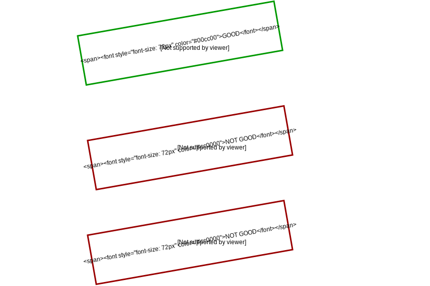

.. qnum::
   :start: 1
   :prefix: ch0208-

Lesson 02-08: If/Else Statements
================================

**Learning Target: I can use if/else statements to execute code conditionally.**

Adding to if Statements
-----------------------

When you use ``if`` statements, you are testing to see if a boolean condition is ``True``.  What if you wanted to execute some code if it is ``True``, but to also execute some code if it is ``False?``  While you could use the following code:

::
   
   if condition:
       #do stuff
   if not condition:
       #do other stuff

...it would be inefficient and difficult to read.  There's an easier way to do this, by using the ``else`` keyword.

The ``else`` keyword is always attached to an ``if`` statement.  It basically means "otherwise", or "for all other cases".  It will only run if the ``if`` statement is false.

Here's how the syntax looks:

::
   
   if condition:
       #code to run if condition is True
       else:
          #code to run if condition is False

Notice that the ``else`` statement is on the same vertical level as the ``if`` statement.  Syntax with these control structures are very specific and very strict - they have to be, otherwise the computer would not understand your code.  :misc-hl:`Make sure that your else statement is always in line with the if statement, and the code that comes after it should be tabbed in, just like the if statement.`

Here are two examples of common errors when it comes to aligning text with if/else statements.

Note that when it comes to if/else statements, only one outcome will be run.  It is not possible for both the ``if`` statement and the ``else`` statement to run right after each other.  In fact, if the first ``if`` statement is true, it won't even check the ``else`` - it will skip right over it.

An Example in Code
------------------

Take the following example:

.. activecode:: 0205_ex_1
   
   choice = input("Yes or No?")
   if choice == "Yes":
       print("You picked yes!")
   else:
       print("You picked no..")

Try running it, and try putting in different inputs!  You might try typing "Yes", which the program will print out "You picked yes!".  If you typed in "No", the program will print "You picked no..".  But if you typed in anything else, you might've noticed that the program will still print "You picked no..".  This is because the ``else`` statement doesn't actually check the input at all!

