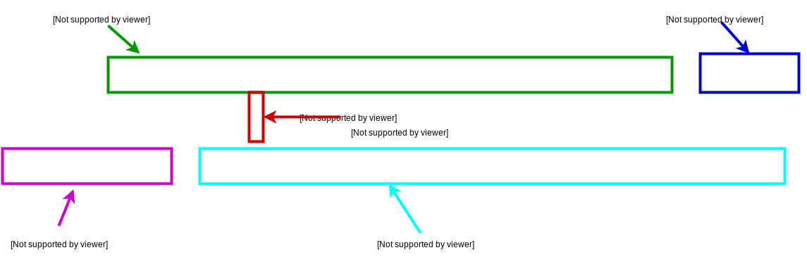

.. qnum::
   :start: 1
   :prefix: u0302-

Lesson 03-02: Python's Error Messages
=====================================

**Learning Target: I can interpret error messages to debug code.**

*Note: All errors and screenshots in this lesson are from a python console, and may not be the exact same message from the errors you would get from this site.*

Types of Errors
---------------

Over the course of learning programming, you will come across many different types of errors.  In most programming languages, whenever an error stops program execution, you will also see an :vocab-word:`error message` - which :vocab-def:`provides information about the error, including where it is and what type of error it is`.

For example, if we were to run the following code in a as a python program:

::
   
   print("hi")
   print "there"

When we execute this program, we would see:

.. code-block:: none
   
        File "/path/to/file.py", line 2
          print "there"
                      ^
   SyntaxError: Missing parentheses in call to 'print'

There is some very important information here!  Let's break it down.

1. Location - This points to the file where the error is happening.  It's important because later on, we'll be working with multiple files, and we will want to pinpoint exactly where the error is.
2. Location (again) - This time, it tells you exactly which line on the file is causing the error.
3. Location (again) - And again, the message is telling you exactly where in the line the error is occurring.  Note that here, it may be a little inaccurate, but is generally in the right area.
4. Type of Error - The name of the error - covered in this lesson.
5. Error Description - It gives a short description as to where the error occurred.

As you can see, error messages provide a LOT of information about where the error is, so you can easily find the location and debug it!

