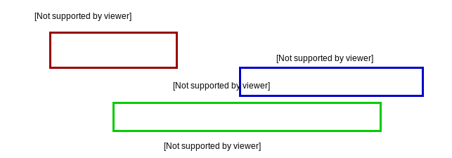

.. qnum::
   :start: 1
   :prefix: u0307-

Lesson 03-07: Accumulator Algorithms
====================================

**Learning Target: I can write an accumulator algorithm.**

An Example of an Accumulator Algorithm
--------------------------------------

Accumulator comes from the word accumulate, which means "gradually gather or acquire".  In programming, we use accumulator algorithms for the same purpose.  For example, if we wanted to use loops to add up all positive integers up to 10, how would we do that?

.. activecode:: 0307_ex_1
   :autorun:

   sum = 0
   for num in range(1,21):
       sum = sum + num
   
   print("The sum is {}".format(sum))

Here is that same code, except with added print statements to detail the process:

.. activecode:: 0307_ex_2
   :autorun:

   print("# initialize the sum at zero")
   sum = 0
   print("# running a for loop from 1 to 11, which will end at 10")
   for num in range(1,11):
       print("# adding {} to {}, resulting in {}".format(num,sum,num+sum))
       sum = sum + num
       print("# saved result {} in our running total (sum)".format(sum))
   
   print("The sum is {}".format(sum))

Breaking Down the Accumulator Algorithm
---------------------------------------

The accumulator algorithm can be broken down into three parts:

1. **Variable Initialization** - You will have to have a variable that keeps track of your running total.  This variable has to be initialized outside the loop.  If you initialize it inside the loop, you will be repeatedly setting it to 0.
2. **The Iterator** - You need to figure out what iterator (in these cases, a range) will work best for your loop.  Need to look at all the even numbers between 2 and 100?  Better use a ``range(2,101,2)``.  Later on, we'll learn how to iterate over strings and lists as well.
3. **The Update Statement** - Since this is an accumulator algorithm, you should probably be accumulating something!  This statement is for updating your running total with the new total.  This doesn't have to happen *every time* the loop runs, for example, if it's inside of an ``if`` statement.

Let's do an example: Let's get the product (multiplication) all the numbers that end in "4" from 1 to 100.

We start with our variable initialization - I'm gonna call mine ``total`` and set it to 1.  I don't want to set it to zero because I know I'm going to be multiplying, and if I multiply anything by zero, it will always be zero!

.. code-block:: python3
   :linenos:
   :emphasize-lines: 1

   total = 1

Next, I have to think about what I want to look at - in this case, what numbers do I need to look at?  I could look at every number between 1 and 100, and that would be a waste - but I'm going to do it anyway to illustrate a point.  Our range will therefore be ``range(1,101)``, since we want to include 100.

.. code-block:: python3
   :linenos:
   :emphasize-lines: 2

   total = 1
   for n in range(1,101):

Next is the update statement. I know my update statement is multiplication, and that statement would look like ``total = total * num``.  However, I only want to do that when the number ends in 4.  How do we know if a number ends in 4?  Well, it's a bit tricky, but we can do this:

``n % 10 == 4``

This will take the remainder of dividing the number by 10, which drops everything except for the last digit 10, 100, 100, etc are all divisible by 10, so they all go away).  This boolean expression will tell us if a number ends in 4 or not.

.. code-block:: python3
   :linenos:
   :emphasize-lines: 3,4

   total = 1
   for n in range(1,101):
       if n % 10 == 4:
           total = total * num

Finally, I want to make sure I'm correct, so I print out the number and run it!.

.. activecode:: 0307_ex_3
   :autorun:
   
   total = 1
   for n in range(1,101):
       if n % 10 == 4:
           total = total * n

   print("The total is {}".format(total))

Although I don't know what the actual answer is, so I will just punch the following into `wolframalpha <https://wolframalpha.com>`_:

``4 * 14 * 24 * 34 * 44 * 54 * 64 * 74 * 84 * 94``

And I get ``4060162871525376`` as my answer.  It matches!

What I did was the inefficient way as well - a clever programmer may have figured out that I could simply make a better range and come to the same conclusion:

.. activecode:: 0307_ex_4
   :autorun:
   
   total = 1
   for n in range(4,101,10):
       total = total * n

   print("The total is {}".format(total))

(This code will loop 10 times, whereas the other loops 100 times)

Checks For Understanding
------------------------

Q#1
~~~

Using an accumulator algorithm, find the sum of all odd positive integers from 1 to 1000.  Print out the result.  If the result matches ``250000``, then you got it correct!  If you want to use codelens/pythontutor for help, you can find it by `clicking here <http://pythontutor.com/visualize.html#mode=edit>`_.  Be sure to switch over to Python 3.3!

.. activecode:: 0307_cfu_1
   :nocodelens:
   
   #write solution here

Q#2
~~~

A factorial ``!`` of an integer is the product of all positive integers up to and including the integer.  For example, :math:`3! = 3 \times 2 \times 1` and :math:`5! = 5 \times 4 \times 3 \times 2 \times 1`.  Using an accumulator algorithm, find the result of :math:`10!`.  If the result matches ``3628800``, then you got it correct!  If you want to use codelens/pythontutor for help, you can find it by `clicking here <http://pythontutor.com/visualize.html#mode=edit>`_.  Be sure to switch over to Python 3.3!

.. activecode:: 0307_cfu_2
   :nocodelens:

   #write solution here

Q#3 (extension)
~~~~~~~~~~~~~~~

Not exactly an algorithm, as nothing is accumulated, but it has a similar algorithm.  Use a for loop to test if ``990023`` is a prime number or not.  Have it print out either ``"990023 is a prime number!"`` or ``"990023 is NOT a prime number!"``.  Note that your ``range`` will only have to reach :math:`990023 \div 2` at maximum since there can't be any factors greater than that.

Try to implement tricks into your range to reduce the number of times it has to loop!

.. activecode:: 0307_cfu_3
   :nocodelens:

   #write solution here
   
*(yes - 990023 is prime - but you should write your program as it should work for any number!)*