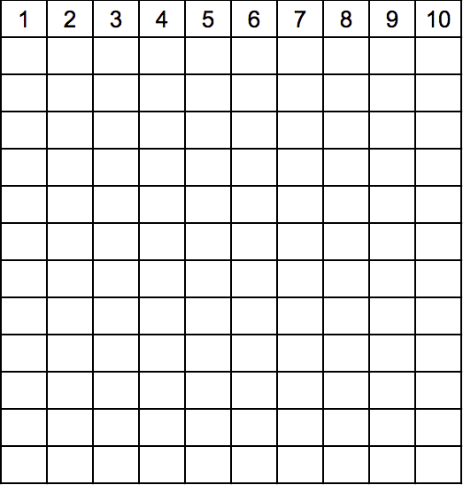
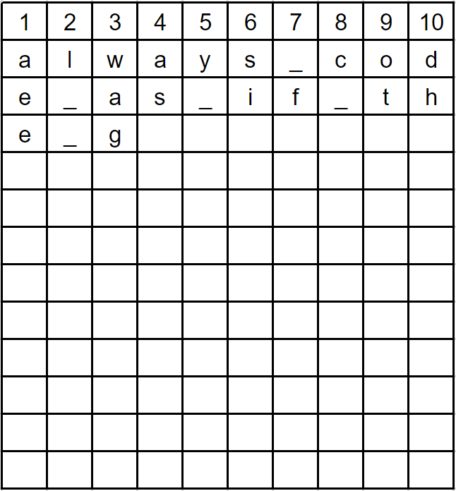
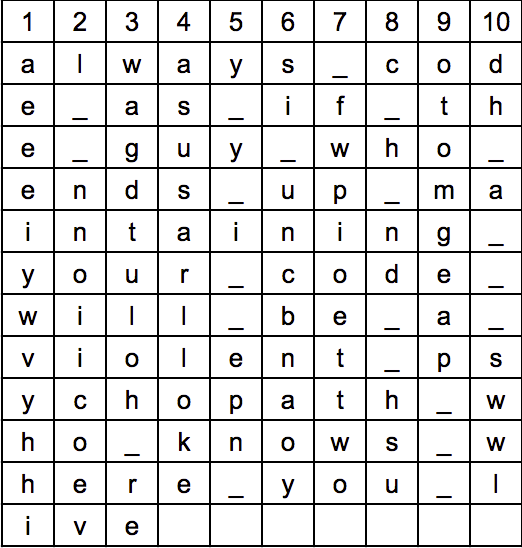
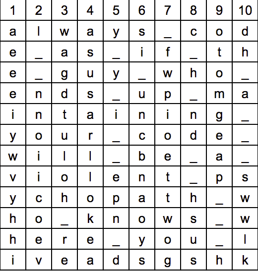
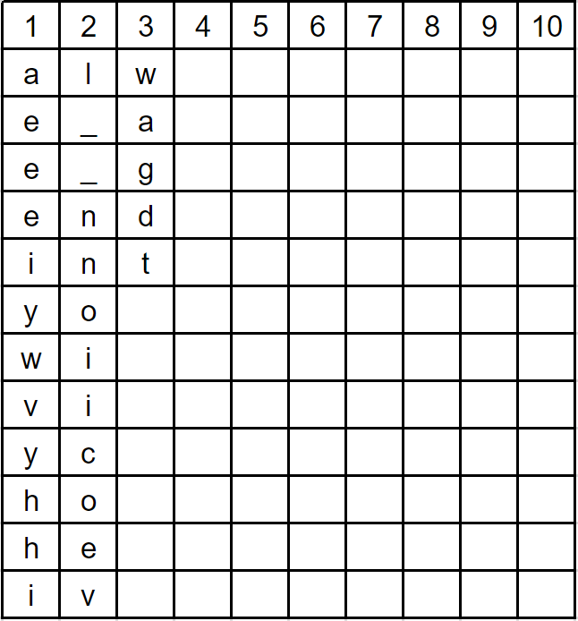

.. qnum::
   :start: 1
   :prefix: lab06-02-1-

..  Copyright (C) 2016 Timothy Chen.  Permission is granted to copy, distribute
    and/or modify this document under the terms of the GNU Free Documentation
    License, Version 1.3 or any later version published by the Free Software
    Foundation; with the Invariant Sections being Contributor List, Lesson 00-01: 
    Introduction To The Course, no Front-Cover Texts, and no Back-Cover Texts.  
    A copy of the license is included in the section entitled "GNU Free 
    Documentation License".

Pre-Lab 6-2: Transposition Cipher Cipher - Encrypting and Decrypting
====================================================================

Note: Part of this lab came from Al Sweigart's great book, *Hacking Secret Ciphers with Python: A beginner's Guide to cryptography and computer programming with Python*, available online here at `Invent With Python <https://inventwithpython.com/>`_, among his other works.  Feel free to check them out if they interest you!

Encrypting with the Transposition Cipher
----------------------------------------

Recall that the Caesar cipher only had 26 possible keys.  It's not very secure - easily bruteforced, as you have already written a script for.  The Transposition Cipher is slightly more secure, because its possible number of keys depends on the length of the message.

Let's dive into it.  Let's use the following quote by Martin Goldin as our message to be encrypted:

``always code as if the guy who ends up maintaining your code will be a violent psychopath who knows where you live"``

And let's use a **key** of **10**.

The way it works is that we would start by writing 10 columns (because our key is 10) and enough rows to fill all our letters:

Then we begin writing our message, one character at a time, going across each row.  If we reach the end of a row, we just continue on the next one.  For spaces, I put underscores ``_`` so it is be easier to see.

We continue this process until the entire message is on the grid..

Finally, we have leftover space, so I fill it with some random characters:

And now, to encrypt it, we just writing the letters, starting with the first column, then with the second, and so on.
    - Column 1: ``aeeeiywvyhhi``
    - Column 2: ``l__nnoiicoev``
    - Column 3: ``wagdtuloh_re``

And so on... until we have all of them, then we put them all together to get our final encrpyted message:

::

    aeeeiywvyhhil__nnoiicoevwagdtuloh_reasusarllokeay_y_i__epn_dsi_uncbnaoys_fwpioettwogc_h_nd__hsusotomgeap___hdh_a___swwlk

And here's how it would look with spaces instead of underscores:

::
    
    aeeeiywvyhhil  nnoiicoevwagdtuloh reasusarllokeay y i  epn dsi uncbnaoys fwpioettwogc h nd  hsusotomgeap   hdh a   swwlk

Seems pretty random, right?  It has a few advantages over the Caesar cipher other than having more possible keys; it also cannot be broken through frequency analysis (looking at how often certain letters show up), which would work on many substitution ciphers, including the Caesar cipher.  It will also mix up punctuation and spaces, which the Caesar cipher will not.

Decrypting with the Transposition Cipher
----------------------------------------

As long as you know the key, decrypting with the Transposition Cipher is easy.  It uses a very similar method as above, except reversed.

Start by getting the length of the message and divide it by the key, or ``10``.  The length of this message is 120 characters (if it were an unpadded message, you would always round your number up), and so we divide the message into pieces of length ``120 / 10``, or ``12``. 

::

    aeeeiywvyhhi
    l__nnoiicoev
    wagdtuloh_re
    asusarllokea
    y_y_i__epn_d
    si_uncbnaoys
    _fwpioettwog
    c_h_nd__hsus
    otomgeap___h
    dh_a___swwlk

Then draw up an empty grid 10 columns wide.

Then begin filling in the grid with these messages, except this time, you'll want to write down and not across.  Each 12-character substring should fit into one column.

Continue until the entire message is filled in:

Then we read off the message going left-right, top-down, and the original message is once again clear!

::

    always_code_as_if_the_guy_who_ends_up_maintaining_your_code_will_be_a_violent_psychopath_who_knows_where_you_liveadsgshk

In the next lab, 6-2, you will be implementing the algorithm for encrypting and decrypting with the transposition cipher.
